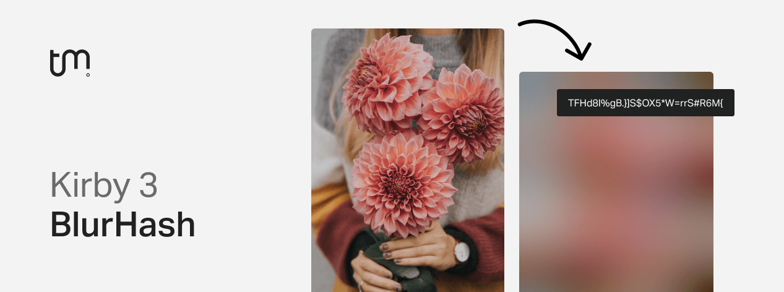
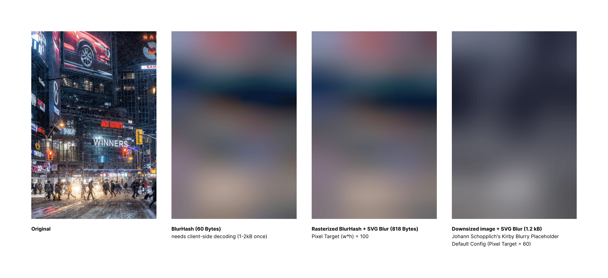
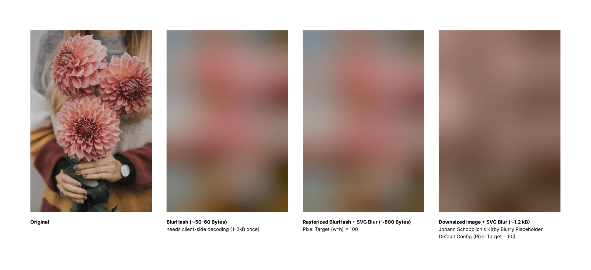
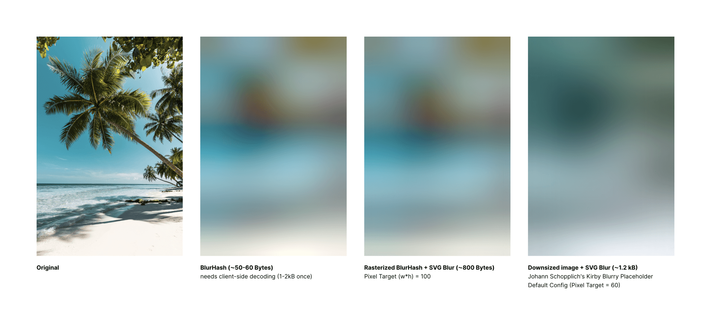

# Kirby BlurHash

[BlurHash](https://blurha.sh) is an optimized image placeholder algorithm, developed at Wolt.
Placeholders are represented by small ∼20-50 bytes hashes, instead of larger (∼1kB+) base64-encoded images.

This plugin adds BlurHash support to Kirby 3, allowing you to implement UX improvements such as progressive image loading or content-aware spoiler images [like Mastodon](https://blog.joinmastodon.org/2019/05/improving-support-for-adult-content-on-mastodon/).

Under the hood, the heavy work gets done by a PHP implementation of BlurHash by [kornrunner](https://github.com/kornrunner): [kornrunner/php-blurhash](https://github.com/kornrunner/php-blurhash)

Be aware that BlurHash currently has [no support for transparency](https://github.com/woltapp/blurhash/issues/100), so it will be rendered in black.

## Requirements

- Kirby 3.9.2+ for asset methods
- PHP 8.0+
- `gd` extension [(required by Kirby)](https://getkirby.com/docs/guide/quickstart#requirements)

## Installation

### Download

Download and copy this repository to `/site/plugins/kirby-blurhash`.

### Composer

```
composer require tobimori/kirby-blurhash
```

## Usage

### Client-side decoding

#### **`$file->blurhash()`**

> Encodes the image with BlurHash and returns BlurHash as a string

The default implementation of BlurHash expects the string to be decoded on the client-side, using a library like [Wolt's blurhash](https://github.com/woltapp/blurhash/tree/master/TypeScript) or [fast-blurhash](https://github.com/mad-gooze/fast-blurhash).

This provides the most benefits, most notably including better color representation and smaller payload size, but requires the initial execution of such a library on the client-side, and thus is better used with a headless site or heavily makes use of client-side infinite scrolling/loading.

An example implementation generating a placeholder image using the BlurHash string could look like this:

```php
<div
  data-blurhash="<?= $image->blurhash() ?>" // BlurHash string as attribute, to access via JS
  style="aspect-ratio: <?= $image->ratio() ?>;"> // Aspect ratio is required as canvas is absolutely positioned
</div>
```

```js
import { decodeBlurHash } from 'fast-blurhash' // https://github.com/mad-gooze/fast-blurhash

const el = document.querySelector('div[data-blurhash]')
if (!el) return

const { blurhash } = el.dataset
if (!blurhash) return

const pixels = decodeBlurHash(blurhash, 32, 32)

const canvas = document.createElement('canvas')
canvas.width = 32
canvas.height = 32

const ctx = canvas.getContext('2d')
if (!ctx) return
const imageData = ctx.createImageData(32, 32)
imageData.data.set(pixels)
ctx.putImageData(imageData, 0, 0)
el.appendChild(canvas)
```

```css
div {
  position: relative;
  width: 400px;
}

canvas {
  position: absolute;
  top: 0;
  right: 0;
  bottom: 0;
  left: 0;
  height: 100%;
  width: 100%;
}
```

Details will vary in your implementation, as this e.g. does not feature lazy-loading capabilities, or you might want to use a different library, but the general idea is to use the BlurHash string as an attribute on an element, and then decode the BlurHash string on the client-side.

### Average color

#### **`$file->blurhashColor()`**

> Encodes the image with BlurHash and returns the average color as a hex string

In order to still provide a small placeholder before a client-side library gets loaded, BlurHash also encodes the average color of an image which we can access and use to enhance lazy-loading when no scripts have been loaded yet.

We can update the snippet above like this:

```php
<div
  data-blurhash="<?= $image->blurhash() ?>"
  style="aspect-ratio: <?= $image->ratio() ?>; background-color: <?= $image->blurhashColor() ?>;">
</div>
```

When you want to get the average color, but already have a BlurHash generated, you can use the `averageColor` static method on the `BlurHash` class instead:

```php
<?php

use tobimori\BlurHash;

$blurhash = 'LKN]Rv%2Tw=w]~RBVZRi};RPxuwH';
echo BlurHash::averageColor($blurhash); // #d0b1a3
```

### Server-side decoding

#### **`$file->blurhashUri()`**

> Encodes the image with BlurHash, then decodes & rasterizes it. Finally returns it as a data URI which can be used without any client-side library.

In addition to simply outputting the BlurHash string for usage on the client-side, this plugin also provides a server-side decoding option that allows you to output a base64-encoded image string, which can be used as a placeholder image without any client-side libraries, similar to [Kirby Blurry Placeholder](https://github.com/johannschopplich/kirby-blurry-placeholder).

This is especially useful when you only have a few images on your site or don't want to go through the hassle of using a client-side library for outputting placeholders. Using this approach, you'll still get better color representation of the BlurHash algorithm than with regularly downsizing an image, but image previews will still be about ~1kB large.

```php
blurhashUri() ?>" />
```

With an lazy-loading library like [vanilla-lazyload (supports everything)](https://github.com/verlok/vanilla-lazyload) or [Loadeer.js (smaller/faster, doesn't support iframes, videos or background images)](https://github.com/johannschopplich/loadeer), your implementation could look like this:

```php
blurhashUri() ?>"
  data-src="<?= $image->url() ?>" // Original src attribute that will be replaced by the lazy-loading library
  data-lazyload // Attribute for browser to know what to lazy-load
  alt="<?= $image->alt() ?>"
/>
```

```js
import LazyLoad from 'vanilla-lazyload'

const lazy = new LazyLoad({ elements_selector: '[data-lazyload]' })
```

### Cropped images

Kirby doesn't support file methods on cropped images, so you'll have to use the original image, and pass the ratio as attribute to the element to get the correct BlurHash.

```php
<?php $cropped = $original->crop(500, 400) ?>
blurhashUri(5/4) ?>"
  data-src="<?= $cropped->url() ?>"
  data-lazyload
  alt="<?= $original->alt() ?>"
/>
```

This is also supported by `$file->blurhash($ratio)` and `$file->blurhashColor($ratio)`.

### Working with static assets (using `asset()` helper)

All methods are available as asset methods since Kirby 3.9.2 and `kirby-blurhash` v1.2.0.

```php
asset('assets/image.jpg')->blurhash();
asset('assets/image.jpg')->blurhashUri();
asset('assets/image.jpg')->blurhashColor();
```

[Read more about the `asset()` helper here](https://getkirby.com/docs/reference/objects/filesystem/asset).

### Aliases

```php
$file->bh(); // blurhash()
$file->bhUri(); // blurhashUri()
$file->bhColor(); // blurhashColor()
```

### Clear cache

The encoding cache is automatically cleared when an image gets replaced or updated, however you can also clear the cache manually with the `clearCache` static method:

```php
<?php

use tobimori\BlurHash;

BlurHash::clearCache($file);
```

This might be helpful when you use third party plugins to edit your images, and they do not trigger Kirby's internal file update hooks but instead have their own.

## Options

| Option             | Default | Description                                                                    |
| ------------------ | ------- | ------------------------------------------------------------------------------ |
| `cache.decode`     | `true`  | Enable decoding cache                                                          |
| `cache.encode`     | `true`  | Enable encoding cache                                                          |
| `sampleMaxSize`    | `100`   | Max width or height for smaller image that gets encoded (watch out for memory) |
| `componentsTarget` | `12`    | Max number of components ("blur points") for encoding (x \* y <= ~x)           |
| `decodeTarget`     | `100`   | Pixel Target (width \* height = ~P) for decoding                               |

Options allow you to fine tune the behaviour of the plugin. You can set them in your `config.php` file:

```php
return [
    'tobimori.blurhash' => [
        'sampleMaxSize' => 200,
        'componentsTarget' => 12,
        'decodeTarget' => 100,
    ],
];
```

## Comparison

[](https://unsplash.com/photos/Ngu3tsqmcRg)
[](https://unsplash.com/photos/VSt-8kKTjWo)
[](https://unsplash.com/photos/3ws2fq3VtXk)

## Credits

- Johann Schopplich's [Kirby Blurry Placeholder](https://github.com/johannschopplich/kirby-blurry-placeholder) plugin that set the baseline for this plugin (Licensed under [MIT License](https://github.com/johannschopplich/kirby-blurry-placeholder/blob/main/LICENSE) - Copyright © 2020-2022 Johann Schopplich)

## License

[MIT License](./LICENSE)
Copyright © 2023 Tobias Möritz
